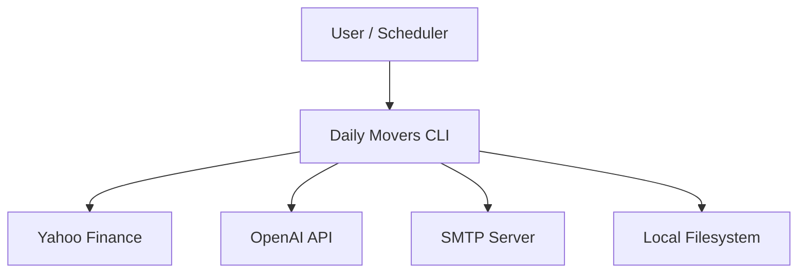

## Executive summary
This repository is a local CLI pipeline that fetches market data, enriches it, runs an agentic analysis, and renders HTML/Excel/email outputs. The highest-risk themes are outbound dependency trust (Yahoo/OpenAI/SMTP), credential handling (OpenAI/SMTP), and supply-chain reproducibility. There is no inbound network service, so remote attackers are limited to influencing upstream data or compromising the local runtime.

## Scope and assumptions
- In-scope paths: `daily_movers/`, `scripts/`, `tests/`, `specs/`, `README.md`, `pyproject.toml`, `requirements*.txt`, `docs/`.
- Out of scope: UiPath project exports, deployment infrastructure, multi-tenant hosting, and any external orchestrator not present in this repo.
- Assumptions (confirmed/likely):
  - CLI is executed by a trusted user on a local machine (no inbound server). (Evidence: `daily_movers/cli.py` entrypoint)
  - Watchlist input is from Yahoo or known sources; no untrusted uploads. (User confirmation)
  - Outbound calls only to Yahoo Finance, OpenAI (optional), and SMTP. (Evidence: `daily_movers/providers/yahoo_movers.py`, `daily_movers/providers/yahoo_ticker.py`, `daily_movers/pipeline/llm.py`, `daily_movers/email/smtp_backend.py`)
  - Email is via Ethereal for demo use. (User confirmation)
- Open questions that would materially change risk:
  - Will this run on shared infrastructure (CI/VM) with multiple users?
  - Will any third party provide watchlist inputs or output destinations?

## System model
### Primary components
- CLI entrypoint and orchestration pipeline. (Evidence: `daily_movers/cli.py`, `daily_movers/pipeline/orchestrator.py`)
- Ingestion + enrichment from Yahoo endpoints and RSS. (Evidence: `daily_movers/providers/yahoo_movers.py`, `daily_movers/providers/yahoo_ticker.py`)
- Agentic analysis with LangGraph and OpenAI fallback. (Evidence: `daily_movers/pipeline/agent.py`, `daily_movers/pipeline/llm.py`)
- Rendering outputs: HTML, Excel, and email (EML/SMTP). (Evidence: `daily_movers/render/html.py`, `daily_movers/render/excel.py`, `daily_movers/email/*`)
- Local artifacts and cache storage. (Evidence: `daily_movers/storage/cache.py`, `daily_movers/storage/runs.py`)

### Data flows and trust boundaries
- User / Scheduler → CLI
  - Data: CLI flags, date, region, watchlist path.
  - Channel: local process invocation.
  - Security: OS user boundary; no explicit validation beyond argparse.
  - Validation: argparse choices for region/source, watchlist file existence check. (Evidence: `daily_movers/cli.py`, `daily_movers/providers/yahoo_movers.py:load_watchlist_symbols`)
- CLI → Yahoo Finance (HTTPS)
  - Data: ticker symbols, screener requests.
  - Channel: HTTPS GET.
  - Security: TLS via `requests`.
  - Validation: ticker regex and URL-encoding before requests. (Evidence: `daily_movers/providers/yahoo_movers.py:_TICKER_RE`, `daily_movers/providers/yahoo_ticker.py:quote(...)`)
- CLI → OpenAI API (optional, HTTPS)
  - Data: analysis prompts containing ticker/enrichment data.
  - Channel: HTTPS POST.
  - Security: TLS; API key in header.
  - Validation: none for base URL; relies on config. (Evidence: `daily_movers/pipeline/llm.py`)
- CLI → SMTP Server (optional)
  - Data: HTML digest email.
  - Channel: SMTP STARTTLS/SSL.
  - Security: TLS context created for STARTTLS. (Evidence: `daily_movers/email/smtp_backend.py`)
- CLI → Local filesystem
  - Data: HTML/Excel/EML reports, logs, cache.
  - Channel: file IO.
  - Security: OS permissions only. (Evidence: `daily_movers/storage/runs.py`, `daily_movers/storage/cache.py`)

#### Diagram

## Assets and security objectives
| Asset | Why it matters | Security objective (C/I/A) |
| --- | --- | --- |
| OpenAI API key | Prevent unauthorized use and cost exposure | C |
| SMTP credentials | Prevent email abuse or account compromise | C |
| Run artifacts (`digest.html`, `report.xlsx`, `archive.jsonl`) | Integrity of analysis and reporting | I |
| Logs (`run.log`, `run.json`) | Operational debugging, audit trail | I |
| Cache (`.cache/http`) | Prevent poisoning or stale data misuse | I |
| System availability | Daily report generation must complete | A |

## Attacker model
### Capabilities
- Remote attacker can influence upstream data sources (Yahoo RSS/HTML/JSON) or cause throttling.
- Network attacker can attempt to induce errors or malformed responses (within HTTPS/TLS constraints).
- Local attacker (if on shared machine) can read or modify local files.

### Non-capabilities
- No direct inbound network access to the CLI.
- No privilege escalation assumed beyond the OS user running the process.

## Entry points and attack surfaces
| Surface | How reached | Trust boundary | Notes | Evidence (repo path / symbol) |
| --- | --- | --- | --- | --- |
| CLI args | User invokes CLI | Local user → CLI | Input validation via argparse | `daily_movers/cli.py:build_parser` |
| Watchlist file | Local file read | Filesystem → CLI | YAML/JSON parsing and ticker validation | `daily_movers/providers/yahoo_movers.py:load_watchlist_symbols` |
| Yahoo screener/HTML | Outbound HTTP | CLI → Yahoo | Upstream content may be malformed | `daily_movers/providers/yahoo_movers.py:get_us_movers` |
| Yahoo RSS/quote HTML | Outbound HTTP | CLI → Yahoo | RSS/HTML parsing from upstream | `daily_movers/providers/yahoo_ticker.py:fetch_headlines`, `fetch_quote_profile_fields` |
| OpenAI API | Outbound HTTP | CLI → OpenAI | API key used in headers | `daily_movers/pipeline/llm.py:OpenAIAnalyzer.synthesize` |
| SMTP | Outbound SMTP | CLI → SMTP | STARTTLS/SSL | `daily_movers/email/smtp_backend.py:send_message` |
| HTML/Excel rendering | Local output | CLI → Filesystem | Rendered links and evidence text | `daily_movers/render/html.py`, `daily_movers/render/excel.py` |

## Top abuse paths
1. Attacker controls upstream RSS links → HTML/Excel include a malicious link → user clicks → phishing or malware exposure.
2. Misconfigured `OPENAI_BASE_URL` (non-HTTPS) → API key sent over insecure channel → key exfiltration and account abuse.
3. Supply-chain compromise via loose dependency constraints → malicious package version installed → arbitrary code execution on host.
4. Upstream throttling or hostile responses → repeated failures → no daily output (availability impact).
5. Local attacker modifies cache or output files → report integrity compromised → incorrect decisions.
6. SMTP credentials used on shared machine → credentials exposed via environment or logs → email abuse.

## Threat model table
| Threat ID | Threat source | Prerequisites | Threat action | Impact | Impacted assets | Existing controls (evidence) | Gaps | Recommended mitigations | Detection ideas | Likelihood | Impact severity | Priority |
| --- | --- | --- | --- | --- | --- | --- | --- | --- | --- | --- | --- | --- |
| TM-001 | Remote data source | Attacker can influence Yahoo RSS/HTML content | Inject malicious links or misleading text into outputs | User phishing or misinformation | Report artifacts | HTML escapes and URL scheme allowlist in rendering | No domain allowlist; user can still click malicious HTTPS links | Optional allowlist for trusted domains; highlight external domains in UI | Flag non-Yahoo domains in outputs; review logs for unusual links | Medium | Medium | Medium |
| TM-002 | Misconfiguration / local attacker | `OPENAI_BASE_URL` set to non-HTTPS | Exfiltrate API key | Credential theft, cost abuse | OpenAI API key | HTTPS default URL in config | No validation of base URL scheme | Enforce HTTPS in config; warn on non-HTTPS | Log config validation warnings | Low | High | Medium |
| TM-003 | Supply-chain attacker | Loose dependency constraints or compromised mirror | Malicious package execution | Full host compromise | Host integrity | `requirements.lock` exists | Lock file not enforced in CI or install steps | Enforce lock in CI; use hash-checked installs | CI dependency audit; SBOM | Medium | High | High |
| TM-004 | Remote data source | Yahoo/API throttling or failures | Denial of service via rate limiting | Missing or partial daily output | Availability | Cache + retries + backoff; per-host concurrency cap | No explicit circuit breaker or fallback to offline cache | Add circuit breaker and cached stale reads; expose status | Monitor failure counts in `run.log` | Medium | Medium | Medium |
| TM-005 | Local attacker / shared host | Attacker can modify cache or outputs | Poison cache or edit reports | Integrity loss | Cache, artifacts | Cache is best-effort; logs indicate stages | No integrity checks on cache/artifacts | Optional checksum for artifacts; clear cache for fresh runs | Compare report hashes; alert on unexpected changes | Low | Medium | Low |
| TM-006 | Local attacker | Access to env or logs on shared host | Steal SMTP credentials | Email abuse | SMTP credentials | STARTTLS/SSL used | No redaction of secrets in logs | Redact sensitive fields in logs; avoid logging creds | Scan logs for secrets | Low | Medium | Low |

## Criticality calibration
Critical: Remote code execution via dependency compromise; cross-tenant data leakage (not applicable here).
High: Credential theft (OpenAI/SMTP) with direct financial or account impact.
Medium: Integrity issues that mislead analysts; recurring DoS causing missing daily runs.
Low: Cosmetic errors, minor parsing failures, local-only integrity issues.

Examples:
- Critical: Malicious dependency executes code on install (TM-003).
- High: API key sent to non-HTTPS endpoint (TM-002).
- Medium: Yahoo throttling blocks daily output (TM-004).
- Low: Cache file edited locally without broader impact (TM-005).

## Focus paths for security review
| Path | Why it matters | Related Threat IDs |
| --- | --- | --- |
| `daily_movers/providers/yahoo_movers.py` | Ingestion, ticker validation, HTML fallback | TM-001, TM-004 |
| `daily_movers/providers/yahoo_ticker.py` | RSS/HTML parsing and enrichment | TM-001, TM-004 |
| `daily_movers/render/html.py` | Output rendering and link safety | TM-001 |
| `daily_movers/render/excel.py` | Output rendering and link safety | TM-001 |
| `daily_movers/pipeline/llm.py` | OpenAI requests and API key handling | TM-002 |
| `daily_movers/email/smtp_backend.py` | SMTP delivery and credentials | TM-006 |
| `daily_movers/storage/cache.py` | Cache integrity and retries | TM-004, TM-005 |
| `requirements.txt` / `requirements.lock` / `pyproject.toml` | Dependency constraints | TM-003 |
| `.env.example` | Credential configuration patterns | TM-006 |

## Notes on use
- Checklist:
  - All discovered entry points are covered above.
  - Each trust boundary is reflected in threats.
  - Runtime vs CI/dev tooling are separated in scope.
  - User clarifications and assumptions are documented.
  - Open questions are listed explicitly.
